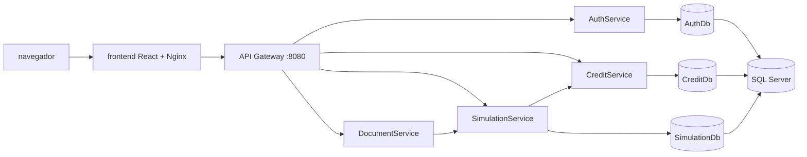
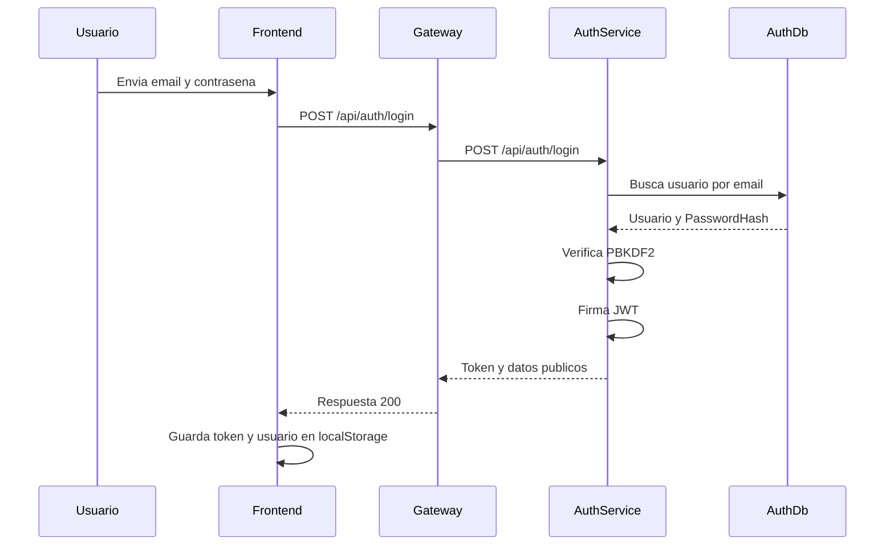
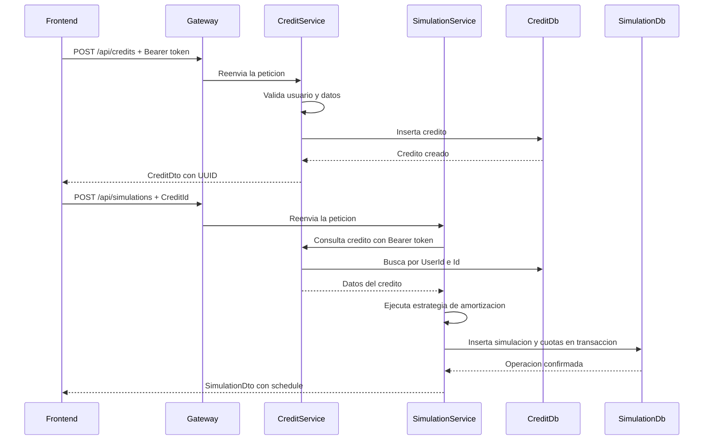

# Arquitectura y funcionamiento del sistema

## 1. Proposito del documento

Este documento explica tecnicamente el funcionamiento de la plataforma **Creditos-xd**, una aplicacion para simular creditos, generar tablas de amortizacion, guardar historial y exportar reportes.

La explicacion esta dirigida a una persona que no conoce el repositorio. Se describen:

- La arquitectura general y la responsabilidad de cada componente.
- Los directorios y archivos mas importantes.
- El recorrido de una solicitud desde el frontend hasta la base de datos.
- El funcionamiento de autenticacion y autorizacion.
- La comunicacion entre microservicios.
- El modelo de datos y la relacion entre las bases de datos.
- El arranque, las redes y la persistencia administradas por Docker Compose.

## 2. Resumen ejecutivo

El sistema esta organizado como una arquitectura de microservicios con una interfaz web React. El navegador no llama directamente a los microservicios internos: normalmente envia las peticiones al **API Gateway**, que las enruta al servicio correspondiente.

Los componentes principales son:

1. **Frontend**: aplicacion React/Vite servida por Nginx.
2. **API Gateway**: punto de entrada HTTP publico para la API.
3. **AuthService**: registro, login, validacion de tokens y consulta del usuario actual.
4. **CreditService**: operaciones CRUD de creditos del usuario autenticado.
5. **SimulationService**: calculo de amortizaciones, guardado de simulaciones e historial.
6. **DocumentService**: generacion de reportes CSV a partir de simulaciones.
7. **SQL Server**: motor de persistencia.
8. **database-init**: tarea de inicializacion que aplica `database/schema.sql` antes de levantar los servicios que usan datos.



Cada servicio mantiene su responsabilidad y su base logica. El Gateway centraliza el acceso externo, pero no contiene la logica de negocio de creditos, autenticacion o simulaciones.

## 3. Estructura principal del repositorio

```text
Creditos-xd/
|-- compose.yaml
|-- .env
|-- database/
|-- backend/
|   |-- ApiGateway/
|   |-- AuthService/
|   |-- CreditService/
|   |-- SimulationService/
|   |-- DocumentService/
|   `-- tests/
|-- frontend/
|-- docs/
`-- packettracer-fedora/
```

### 3.1 Archivos de infraestructura del proyecto

#### `compose.yaml`

Es el archivo principal de ejecucion local. Define:

- Los contenedores de todos los servicios.
- Las imagenes y Dockerfiles utilizados.
- Los puertos publicados hacia el host.
- Las redes internas y externas.
- Las variables de entorno.
- Las dependencias de arranque.
- El volumen persistente de SQL Server.
- El servicio `database-init`, que ejecuta el esquema SQL.

Las redes tienen estas funciones:

- `edge`: conecta el frontend, el Gateway y herramientas externas como CloudBeaver.
- `backend`: red interna para la comunicacion entre Gateway y microservicios.
- `data`: red interna para SQL Server y los servicios que acceden a datos.

El backend no queda expuesto directamente al navegador. El puerto publico de la API es el del Gateway, normalmente `8080`.

#### `.env`

Contiene valores locales que Compose inyecta en los contenedores. Entre ellos:

- `SQL_SA_PASSWORD`: credencial de SQL Server.
- `JWT_KEY`: clave utilizada para firmar tokens.

En un ambiente real estos valores deben gestionarse mediante secretos del entorno y no compartirse en el repositorio.

#### `database/schema.sql`

Crea las bases `AuthDb`, `CreditDb` y `SimulationDb` si aun no existen. Tambien crea sus tablas principales.

El servicio `database-init` monta este archivo, espera a que SQL Server este saludable y lo ejecuta con `sqlcmd`. Los servicios de datos dependen de que esta tarea termine correctamente.

### 3.2 Directorio `backend/`

Contiene la solucion .NET y los microservicios. El archivo `backend/SimuladorCreditos.Backend.sln` agrupa los proyectos.

El archivo `backend/Program.cs` pertenece al proyecto agregador y no reemplaza los puntos de entrada de los microservicios. Cada servicio tiene su propio `Program.cs` y su propio Dockerfile.

### 3.3 Directorios de cada microservicio

Los servicios mantienen una organizacion por responsabilidades:

```text
Servicio/
|-- Program.cs
|-- Servicio.csproj
|-- Controllers/
|-- Application/
|-- Domain/
|-- Infrastructure/
`-- Dockerfile
```

- `Program.cs`: registra dependencias y publica endpoints tecnicos como `/health`.
- `Controllers/`: define las rutas HTTP y traduce resultados de aplicacion a codigos HTTP.
- `Application/`: contiene los casos de uso y contratos de entrada/salida.
- `Domain/`: contiene las entidades y reglas propias del dominio.
- `Infrastructure/`: contiene repositorios, lectura de tokens y acceso a recursos externos.
- `*.csproj`: define el proyecto .NET y sus dependencias.
- `Dockerfile`: compila y publica el servicio en una imagen ASP.NET Runtime.

## 4. Backend por servicio

### 4.1 ApiGateway

Directorio: `backend/ApiGateway/`

El Gateway es un proxy HTTP liviano. Su funcion es recibir rutas con la forma:

```text
/api/{service}/{path}
```

Servicios reconocidos:

- `auth`
- `credits`
- `simulations`
- `documents`

Por ejemplo:

```text
GET http://localhost:8080/api/auth/me
```

se transforma internamente en una llamada a:

```text
http://auth-service:8080/api/auth/me
```

El Gateway:

1. Lee el nombre del servicio y la ruta.
2. Resuelve la URL interna desde la configuracion.
3. Copia metodo HTTP, headers, query string y cuerpo.
4. Envia la peticion al microservicio.
5. Devuelve al cliente el status code, headers y cuerpo recibidos.

Tambien publica `GET /health`. Para facilitar las comprobaciones, una ruta como `/api/credits/health` se convierte en una llamada al `/health` interno de `CreditService`.

El Gateway no valida por si mismo el contenido del JWT. El token viaja en el header `Authorization` y cada servicio valida el usuario cuando necesita autorizar una operacion.

### 4.2 AuthService

Directorio: `backend/AuthService/`

Responsabilidades:

- Registrar usuarios.
- Normalizar correos electronicos.
- Hashear contrasenas con PBKDF2.
- Verificar credenciales.
- Crear tokens firmados.
- Resolver el usuario asociado a un token.

Archivos importantes:

- `Controllers/AuthController.cs`: endpoints `/register`, `/login` y `/me`.
- `Application/AuthApplicationService.cs`: casos de uso de registro, login y consulta del usuario.
- `Application/PasswordHasher.cs`: genera y valida hashes PBKDF2.
- `Application/TokenService.cs`: crea y valida tokens con firma HMAC-SHA256.
- `Infrastructure/IUserRepository.cs`: contrato de persistencia de usuarios.
- `Infrastructure/SqlUserRepository.cs`: implementacion SQL Server.
- `Domain/User.cs`: entidad de usuario.

Endpoints:

```text
POST /api/auth/register
POST /api/auth/login
GET  /api/auth/me
```

El registro requiere nombre, email y una contrasena de al menos seis caracteres. El email se guarda normalizado en minusculas y la contrasena nunca se almacena en texto plano.

La respuesta de registro/login contiene:

```json
{
  "token": "<jwt>",
  "user": {
    "id": "<uuid>",
    "name": "Ana Lopez",
    "email": "ana@example.com",
    "createdAtUtc": "<date-time>"
  }
}
```

El frontend conserva el token y los datos basicos del usuario en `localStorage`. En cada peticion posterior, el cliente agrega:

```http
Authorization: Bearer <jwt>
```

### 4.3 CreditService

Directorio: `backend/CreditService/`

Responsabilidades:

- Crear creditos asociados al usuario autenticado.
- Consultar un credito propio.
- Listar creditos propios.
- Actualizar un credito propio.
- Eliminar un credito propio.

Archivos importantes:

- `Controllers/CreditsController.cs`: endpoints CRUD.
- `Application/CreditApplicationService.cs`: validacion y casos de uso.
- `Application/CreditContracts.cs`: `CreditRequest` y `CreditDto`.
- `Domain/Credit.cs`: entidad persistida.
- `Infrastructure/ICreditRepository.cs`: contrato del repositorio.
- `Infrastructure/SqlCreditRepository.cs`: consultas SQL Server.
- `Infrastructure/TokenUserContext.cs`: obtiene el `userId` desde el token.

Endpoints:

```text
GET    /api/credits
GET    /api/credits/{id}
POST   /api/credits
PUT    /api/credits/{id}
DELETE /api/credits/{id}
```

La seguridad se aplica tambien en las consultas: las operaciones filtran por `UserId`. Por eso un usuario no debe poder consultar, modificar o borrar un credito de otro usuario aunque conozca su UUID.

### 4.4 SimulationService

Directorio: `backend/SimulationService/`

Responsabilidades:

- Recibir parametros de simulacion.
- Reutilizar un credito existente si se proporciona `CreditId`.
- Calcular la amortizacion.
- Guardar la simulacion y todas sus cuotas.
- Entregar el historial del usuario.

Archivos importantes:

- `Controllers/SimulationsController.cs`: endpoints de simulacion e historial.
- `Application/SimulationApplicationService.cs`: coordinacion del caso de uso.
- `Application/SimulationContracts.cs`: contratos de entrada y salida.
- `Domain/Simulation.cs`: simulacion y cuota.
- `Strategies/FrenchAmortizationStrategy.cs`: cuota fija y capital variable.
- `Strategies/GermanAmortizationStrategy.cs`: capital fijo y cuota decreciente.
- `Infrastructure/ISimulationRepository.cs`: contrato de persistencia.
- `Infrastructure/SqlSimulationRepository.cs`: persistencia del encabezado y cuotas.
- `Infrastructure/TokenUserContext.cs`: identifica al usuario.

Endpoints:

```text
POST /api/simulations
GET  /api/simulations/history
GET  /api/simulations/{id}
```

Si se envia un `CreditId`, SimulationService llama internamente a CreditService para obtener el credito. Para esa llamada reenvia el header de autorizacion, de forma que la consulta mantiene el aislamiento por usuario.

El guardado de una simulacion usa una transaccion SQL: primero se inserta el registro principal en `Simulations` y despues sus cuotas en `AmortizationInstallments`. Si falla una cuota, se revierte toda la operacion y no queda una simulacion incompleta.

### 4.5 DocumentService

Directorio: `backend/DocumentService/`

Responsabilidades:

- Recibir el UUID de una simulacion.
- Consultar la simulacion en SimulationService.
- Reenviar el token del usuario.
- Generar un archivo CSV descargable.

Este servicio no duplica las tablas de simulaciones. Usa SimulationService como fuente de verdad. Su endpoint principal es:

```text
GET /api/documents/simulations/{simulationId}
```

El resultado incluye informacion general y las columnas de cada cuota:

```text
Periodo,Pago,Capital,Interes,Saldo
```

## 5. Persistencia y conexion con SQL Server

### 5.1 Bases de datos

Se utilizan tres bases logicas dentro del mismo servidor SQL Server:

| Base de datos | Propietario | Tabla principal |
| --- | --- | --- |
| `AuthDb` | AuthService | `Users` |
| `CreditDb` | CreditService | `Credits` |
| `SimulationDb` | SimulationService | `Simulations`, `AmortizationInstallments` |

La separacion mantiene los datos organizados por bounded context. Un servicio no consulta directamente las tablas de otro servicio; cuando necesita informacion ajena usa el endpoint del otro servicio.

### 5.2 Configuracion de conexion

Compose inyecta en cada contenedor una variable con esta forma:

```text
ConnectionStrings__DefaultConnection=Server=sqlserver,1433;Database=<database>;User Id=sa;Password=<password>;Encrypt=True;TrustServerCertificate=True
```

ASP.NET Core convierte los dobles guiones bajos en secciones de configuracion, por lo que el codigo puede leer:

```csharp
configuration.GetConnectionString("DefaultConnection")
```

El nombre `sqlserver` funciona porque es el nombre DNS del servicio dentro de la red Docker `data`. No se debe usar `localhost` desde un microservicio para alcanzar SQL Server: dentro del contenedor, `localhost` apuntaria al propio microservicio.

### 5.3 Tablas

#### `AuthDb.Users`

- `Id`: UUID y clave primaria.
- `Name`: nombre visible del usuario.
- `Email`: email unico.
- `PasswordHash`: hash PBKDF2, nunca la contrasena original.
- `CreatedAtUtc`: fecha de registro en UTC.

#### `CreditDb.Credits`

- `Id`: UUID del credito.
- `UserId`: propietario logico del credito.
- `Name`: nombre del producto o credito.
- `Amount`: monto solicitado.
- `AnnualInterestRate`: tasa anual.
- `TermMonths`: plazo en meses.
- `AmortizationType`: `french` o `german`.
- `CreatedAtUtc`: fecha de creacion.

`UserId` representa la asociacion con AuthDb a nivel de aplicacion. La consulta siempre filtra por ese identificador para mantener la autorizacion.

#### `SimulationDb.Simulations`

Guarda el encabezado de cada simulacion:

- `Id`: UUID de la simulacion.
- `UserId`: propietario logico.
- `CreditId`: UUID opcional del credito de origen.
- `Amount`, `AnnualInterestRate`, `TermMonths` y `AmortizationType`: parametros usados.
- `TotalInterest`: interes total calculado.
- `TotalPayment`: pago total calculado.
- `CreatedAtUtc`: fecha de creacion.

#### `SimulationDb.AmortizationInstallments`

Guarda el detalle de cuotas:

- `Id`: identificador incremental de la fila.
- `SimulationId`: simulacion a la que pertenece.
- `Period`: numero de cuota.
- `Payment`: pago del periodo.
- `Principal`: capital amortizado.
- `Interest`: interes del periodo.
- `Balance`: saldo restante.

La relacion entre `Simulations` y `AmortizationInstallments` se mantiene por `SimulationId`. El repositorio lee las cuotas ordenadas por `Period` para reconstruir el objeto de dominio.

### 5.4 Repositorios SQL

Cada servicio depende de una interfaz de repositorio, no de una implementacion concreta. Por ejemplo, CreditService depende de `ICreditRepository` y en ejecucion se registra `SqlCreditRepository`.

Este diseño permite:

- Mantener los controladores y casos de uso independientes de SQL Server.
- Sustituir el mecanismo de persistencia sin cambiar el contrato de negocio.
- Crear implementaciones de prueba en memoria si se necesitan pruebas unitarias.
- Encapsular las consultas SQL dentro de `Infrastructure/`.

Cada metodo abre una conexion SQL, ejecuta una consulta parametrizada y libera la conexion. Los parametros evitan construir SQL concatenando entrada del usuario.

## 6. Funcionamiento del frontend

Directorio: `frontend/`

### 6.1 Archivos y directorios principales

- `src/main.tsx`: punto de entrada de React.
- `src/App.tsx`: router, layout global, navegacion y control de sesion.
- `src/api.ts`: cliente HTTP, token, usuario almacenado y eventos de sesion.
- `src/credits.ts`: catalogo de opciones de credito usadas por la interfaz.
- `src/pdf.ts`: construccion del reporte PDF en el navegador.
- `src/pages/Login.tsx`: registro e inicio de sesion.
- `src/pages/Dashboard.tsx`: catalogo de productos de credito.
- `src/pages/Simulador.tsx`: formulario, calculo visual, guardado y exportacion.
- `src/pages/Historial.tsx`: lectura de simulaciones guardadas.
- `src/App.css` e `src/index.css`: estilos globales y de componentes.
- `public/`: archivos estaticos.
- `Dockerfile`: compila la aplicacion y la sirve con Nginx.
- `nginx.conf`: configura el fallback SPA.

### 6.2 Rutas de la interfaz

- `/login`: inicio de sesion.
- `/register`: registro.
- `/dashboard`: catalogo de creditos.
- `/simulador`: formulario de simulacion.
- `/historial`: historial protegido.

`BrowserRouter` administra las rutas del cliente. Nginx usa `try_files $uri $uri/ /index.html` para que una recarga directa en `/login`, `/dashboard` o `/historial` entregue la aplicacion React en lugar de responder 404.

### 6.3 Sesion en el navegador

`src/api.ts` mantiene dos valores en `localStorage`:

- `token`: JWT para peticiones protegidas.
- `user`: datos publicos del usuario autenticado.

`request()` agrega automaticamente el header `Authorization` si existe token. Si una respuesta es `401`, limpia la sesion local y notifica el cambio mediante un evento de ventana.

`AppShell` escucha los cambios y muestra el nombre real del usuario autenticado. Si no hay sesion, muestra las opciones de ingreso y registro.

### 6.4 Flujo de simulacion en el frontend

1. El usuario selecciona el tipo de credito, monto, plazo y metodo.
2. El frontend calcula una vista inmediata para no bloquear la experiencia.
3. Si no hay sesion, permite ver el resultado local pero informa que no puede guardar historial ni exportar la simulacion persistida.
4. Si hay sesion, crea primero un credito mediante `POST /api/credits`.
5. Usa el UUID recibido para crear la simulacion mediante `POST /api/simulations`.
6. El backend calcula nuevamente y guarda la simulacion oficial.
7. El frontend muestra el resultado guardado y habilita la exportacion PDF.

La simulacion visual del frontend y la simulacion oficial del backend deben producir resultados equivalentes. El backend es la fuente de verdad para el historial.

## 7. Flujo completo de una solicitud

### 7.1 Inicio de sesion



### 7.2 Crear una simulacion persistida



### 7.3 Descargar un documento

1. El frontend solicita el documento con el token.
2. DocumentService recibe el UUID de la simulacion.
3. DocumentService consulta SimulationService y reenvia el token.
4. SimulationService aplica el filtro por usuario.
5. DocumentService convierte la respuesta en CSV.
6. El navegador descarga `simulacion-{id}.csv`.

## 8. Arranque con Docker

El comando recomendado es:

```bash
docker compose up -d --build
```

El orden logico es:

1. Se inicia SQL Server.
2. SQL Server pasa su healthcheck usando `sqlcmd`.
3. `database-init` ejecuta `database/schema.sql`.
4. AuthService, CreditService y SimulationService esperan el resultado exitoso de `database-init`.
5. Los servicios .NET comienzan a escuchar en el puerto interno `8080`.
6. ApiGateway enruta las peticiones hacia ellos.
7. Nginx sirve el frontend en el puerto `3000`.

Accesos locales:

```text
Frontend:   http://localhost:3000
API Gateway: http://localhost:8080
CloudBeaver: http://localhost:8978
```

Health checks utiles:

```bash
curl http://localhost:8080/health
curl http://localhost:8080/api/auth/health
curl http://localhost:8080/api/credits/health
curl http://localhost:8080/api/simulations/health
curl http://localhost:8080/api/documents/health
```

Para detener los contenedores sin eliminar los datos del volumen:

```bash
docker compose down
```

El volumen `simulador-creditos-sqlserver-data` conserva las bases de datos. Eliminar el volumen implica perder la informacion persistida.

## 9. Seguridad y aislamiento

- Las contrasenas se almacenan como hashes PBKDF2.
- Las llamadas protegidas requieren un JWT.
- Cada servicio valida el `userId` que contiene el token.
- CreditService filtra por usuario en cada consulta.
- SimulationService filtra por usuario en historial y detalle.
- DocumentService consulta la simulacion a traves de SimulationService, no directamente en SQL.
- Las conexiones SQL usan consultas parametrizadas.
- Las redes `backend` y `data` son internas en Docker.
- El cliente externo solo necesita conocer el Gateway.

En produccion se recomienda ademas:

- Usar una clave JWT larga y aleatoria.
- Usar secretos de Docker, un gestor de secretos o variables protegidas.
- Configurar HTTPS y CORS con dominios concretos.
- Agregar limites de longitud y precision alineados con las columnas SQL.
- Agregar claves foraneas y politicas de limpieza si el dominio las requiere.
- Registrar metricas, trazas y errores centralizados.

## 10. Resumen de responsabilidades

| Componente | Responsabilidad principal | No deberia hacer |
| --- | --- | --- |
| Frontend | Interaccion, navegacion y presentacion | Acceder directamente a SQL Server |
| ApiGateway | Entrada publica y enrutamiento | Implementar reglas de creditos |
| AuthService | Usuarios, hashes y JWT | Resolver simulaciones |
| CreditService | CRUD de creditos propios | Calcular tablas de amortizacion |
| SimulationService | Calculo e historial de simulaciones | Emitir documentos CSV |
| DocumentService | Reportes derivados | Ser fuente principal de simulaciones |
| SQL Server | Persistencia | Contener logica de autorizacion |
| `database-init` | Preparar el esquema | Atender trafico de usuarios |

La idea central es que cada capa tenga una responsabilidad clara: el frontend presenta, el Gateway conecta, los microservicios aplican reglas de negocio y SQL Server persiste la informacion.
